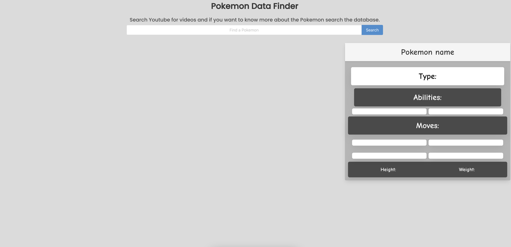
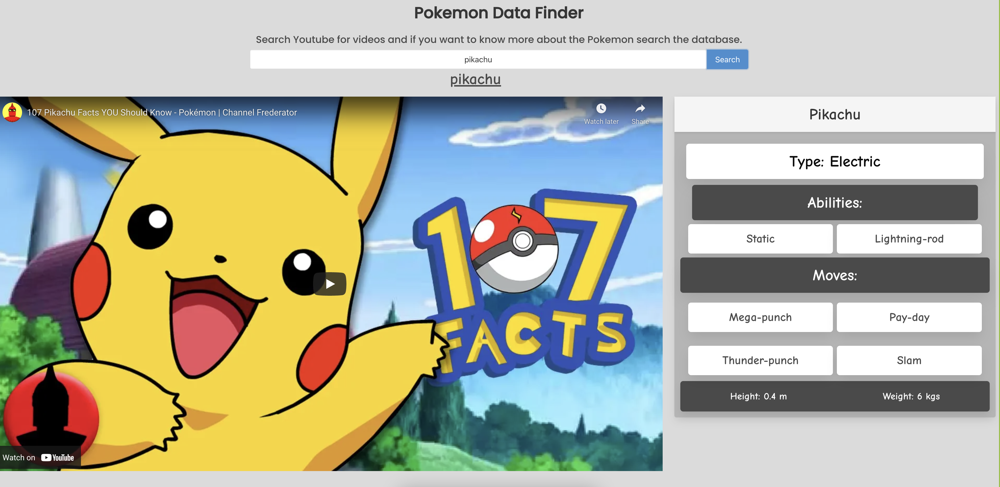
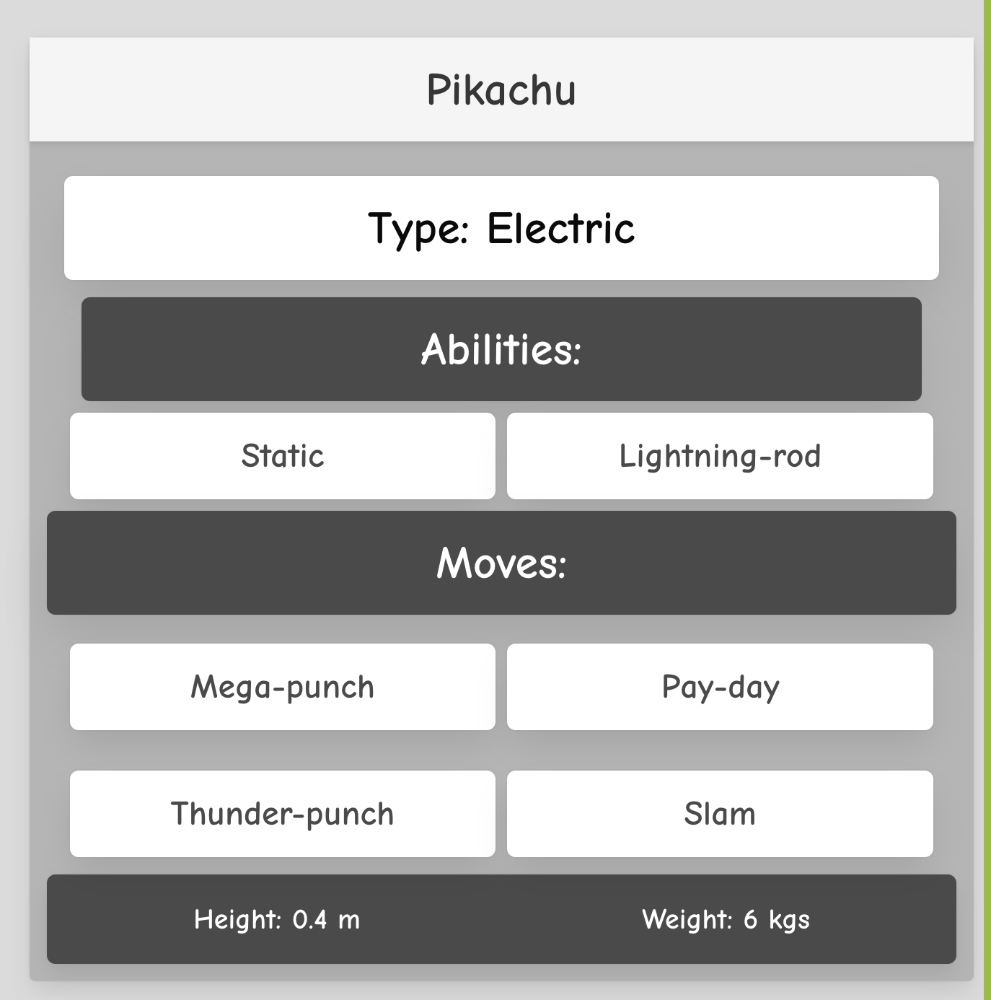
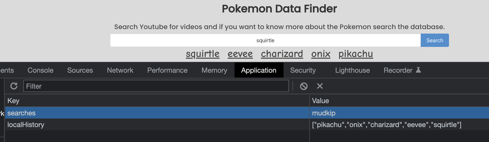

<h1><a href="https://jamehzlee.github.io/Project-1-Group-2/">Pokemon Data Finder<a></h1>

## Description
When a user searches a pokemon name, they will be shown a video and the stats.

## Initial display of website 

## After user searches for Pokemon

## PokeAPI
Calls the API to get info on the Pokemon the user searches 

## YouTube API
Calls the API to get a video on the Pokemon the user searches

## Local Storage displayed
Stores 5 most recent searches in users local storage
Then user can click on one of the recent searches to redisplay previous search
